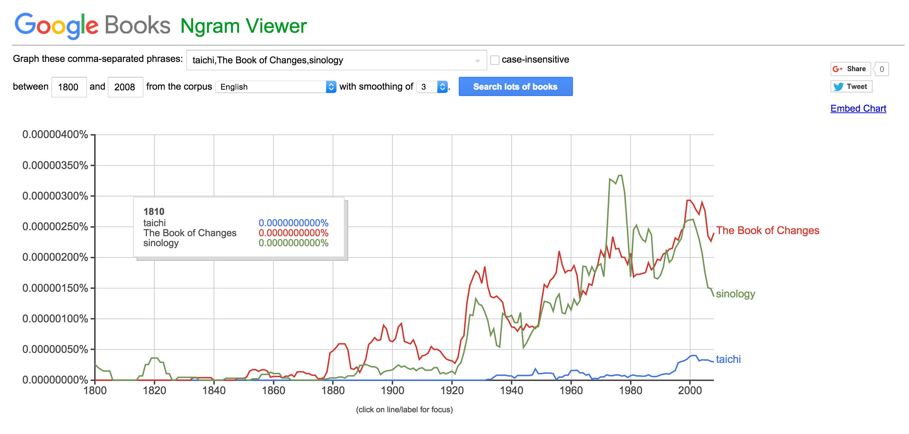

# 课程1——课后作业

- Author: <yuechaoshiwo@126.com>
- Date: January 11, 2016 

--- 

## 问题一：

- 你认为应该用什么样的数字来度量中国人的生活水平变化？
- 尝试找到这样的数据源并画出图看看。
- 用这种数字来衡量有什么样的缺点？ 

- **解答：**
	- 首先，要明确『中国人的生活水平』是一个什么口径，『水平高和低』的判断标准是怎么样的。不同的口径就产生了不同的指标，比如『人均GDP』，『恩格尔系数』，『基尼系数』等等。但是想要通过一个系数或者一个数据精确定义『生活水平』，很难。
	- 其次，退而求其次，既然不能明确描述和定义，就选一个主要成分来分析。比如，马斯洛的需求分析中，『温饱』需求是第一的。如果单独从人生存和生活角度考虑，可以使用[恩格尔系数](http://www.bing.com/knows/search?q=%E6%81%A9%E6%A0%BC%E5%B0%94%E7%B3%BB%E6%95%B0&mkt=zh-cn&FORM=BKACAI)。毕竟，『物质』的身外之物可以抛弃，『温饱』问题必须要解决；
	- 根据联合国粮农组织提出的标准，恩格尔系数在59%以上为贫困，50-59%为温饱，40-50%为小康，30-40%为富裕，低于30%为最富裕。近几年中国的恩格尔系数在下降，意味着中国人的生活水平在提升；
	- [城镇居民恩格尔系数的趋势图](http://bbs.tianya.cn/post-no04-2266798-1.shtml)；
	- <u>缺点</u>：
		- 恩格尔系数反映的是一种长期的趋势，而不是逐年下降的绝对倾向，在某个年份数据波动会比较大；
		- 恩格尔系数仅仅是从饮食消费占比衡量生活水平，不涉及『住房』、『教育』等问题，这些问题，中国人更关注。另外，在中国是否适用学术界一直存有争议，持否定意见的认为中国居民生活状况并不符合恩格尔定律，如1997年福建省城镇居民恩格尔系数在全国各省中最高，达到62%，海南省为59%；而生活水平较低的陕西省城市居民恩格尔系数为47%，宁夏为46%；
		- 再比如，中国的房价这么高，就算恩格尔系数低于10%，有啥意义。还是买不起房子，也过不上所谓的『幸福生活』！

--- 

## 问题二：

- 理解什么是双盲实验：
	- <u>[双盲实验]</u>(http://www.bing.com/knows/search?q=%E5%8F%8C%E7%9B%B2%E5%AE%9E%E9%AA%8C&mkt=zh-cn&FORM=BKACAI)：双盲实验是一种更加严格的实验方法，通常适用于以人为研究对象的实验（human subjects），旨在消除可能出现在实验者和参与者意识当中的主观偏差（subjective bias）和个人偏好（personal preferences）。在大多数情况下，双盲实验要求达到非常高的科学严格程度。在双盲实验中，实验者和参与者都不知道哪些参与者属于对照组（control group）、哪些属于实验组（experimental group）。只有在所有数据被记录完毕之后（在有些情况下是分析完毕之后），实验者才能知道那些参与者是哪些组的。采用双盲实验是为了要减少偏见（prejudices）和无意识地暗示（unintentional physical cues）对实验结果的影响。对于被试者的随机分配（Randomassignment）到对照组或者实验组的做法是双盲实验中至关重要的一部。确认哪些受试者属于那些组的信息交由第三方保管，并且在研究结束之前不能告知研究者。
	- 目前互联网公司普遍采用的A/B Test，假如用户不知道哪些是新的设计，可以看做一个『双盲实验』。

- 学习使用google ngram服务，并研究你关心的某一组词汇的变化
	- 观察了『taichi,The Book of Changes,sinology』（太极，易经，国学）的变化；
	- 

- 理解什么是「Simpson's Paradox」 
	- [辛普森悖论](https://en.wikipedia.org/wiki/Simpson%27s_paradox)
	- <u>表现</u>：辛普森悖论（Simpson's Paradox）亦有人译为辛普森诡论，为英国统计学家E.H.辛普森（E.H.Simpson）于1951年提出的悖论，即在某个条件下的两组数据，分别讨论时都会满足某种性质，可是一旦合并考虑，却可能导致相反的结论。
	- <u>解决办法</u>：为了避免辛普森悖论的出现，就需要斟酌各分组的权重，并乘以一定的系数去消除以分组数据基数差异而造成的影响。

--- 

## 问题三：

- 学习贝叶斯定理，做下题：已知某种疾病的发病率是0.001，即1000人中会有1个人得病。现有一种试剂可以检验患者是否得病，它的准确率是0.99，即在患者确实得病的情况下，它有99%的可能呈现阳性。它的误报率是5%，即在患者没有得病的情况下，它有5%的可能呈现阳性。现有一个病人的检验结果为阳性，请问他确实得病的可能性有多大？

- 解答：
  - [参考资料：](http://wenku.baidu.com/link?url=SJy_MX1alWLreWe5iZqr84C4Tyo_vXR9R2S99a1ia8NAQdhl6nO8mc_PXHRiR0TZ7tsEAW3EWPw9PGaWeyAUOtEzCw651n9vgl-p1C5oc9K)
